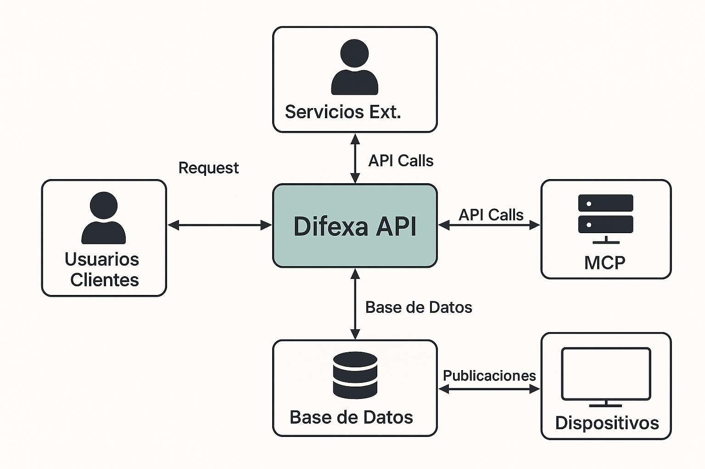

### Prompt para GitHub Copilot: Generación de Historias de Usuario y Criterios de Aceptación

Actúa como un experto en metodologías ágiles y gestión de requisitos. Tu tarea es generar **historias de usuario** y sus **criterios de aceptación** a partir de una descripción general de un software. Tu objetivo es producir un conjunto de requisitos **claros, concisos, centrados en el usuario y verificables**.

Sigue estas pautas clave para cada historia de usuario:

#### 1. Formato de la Historia de Usuario:
- Utiliza el formato estándar, conocido como la plantilla de Connextra: "**Como**, `<rol de usuario>` **quiero** `<funcionalidad/objetivo>`, **para que** `<beneficio/resultado>`.
- La historia debe ser **breve y concisa**, idealmente alrededor de 100 caracteres. Si una historia crece demasiado, dividirla en dos historias diferentes.
- Cada historia debe centrarse en **UNA funcionalidad específica**.

#### 2. Características de Calidad (INVEST): Asegúrate de que cada historia de usuario cumpla con los principios INVEST:
- **Independientes (Independent):** La historia debe ser autónoma y no depender de otras tareas para su implementación.  
- **Negociables (Negotiable):** La historia en sí no debe ser un contrato cerrado, sino un punto de partida para la discusión y el esclarecimiento del alcance.  
- **Valiosas (Valuable):** Debe aportar un valor claro y tangible al usuario final, conectando con objetivos de mayor nivel.  
- **Estimables (Estimable):** Debe ser posible estimar el tiempo que tomará completarla, generalmente entre unas 10 horas y un par de semanas. Si es mayor, debe dividirse.  
- **Pequeñas (Small):** Debe representar una cantidad de trabajo que se pueda realizar en un período corto de tiempo.  
- **Testables/Verificables (Testable):** Debe permitir la creación de una o más pruebas claras para determinar si la funcionalidad implementada cumple con los requisitos definidos.

#### 3. Enfoque y Perspectiva:

- **Perspectiva del Usuario Final:** Redacta las historias siempre desde la perspectiva de quien se beneficia de la función (el usuario o cliente), no desde una perspectiva técnica o de quien la solicita (como un Product Owner o el equipo).  
- **Resultado Deseado, No Detalles de Implementación Técnica:** Concéntrate en el **resultado o la experiencia del usuario** ("el qué") y el **beneficio** ("el por qué"), no en los detalles de cómo se construirá la solución a nivel técnico ("el cómo").

#### 4. Criterios de Aceptación: Para cada historia de usuario, define un conjunto de **criterios de aceptación** que son las condiciones específicas que la función debe satisfacer para ser considerada completa.

- Deben ser **claros, concisos y verificables**.  
- Deben ser declaraciones concretas que describen el comportamiento esperado del sistema.  
- Abarca tanto **casos positivos** (comportamiento normal) como **casos negativos/excepcionales** (ejemplos: cuando una contraseña es incorrecta, cuando una tarjeta de crédito es rechazada, cuando se omiten escenarios de borde).  
- Siempre que sea posible, expresarlos en **términos medibles** para permitir una determinación clara de "pasa/falla" durante las pruebas.  
- Cada criterio de aceptación debe ser, idealmente, **independiente** de los demás.  
- No te obsesiones con cubrir cada detalle en los criterios de aceptación.

#### 5. Evita Errores Comunes:

- **Historias Demasiado Grandes (Épicas):** Si una funcionalidad es muy compleja o amplia para una sola historia, considerarla una "épica" y luego desglosar en varias historias de usuario más pequeñas y manejables.  
- **Ambigüedad o vaguedad:** Evita el lenguaje ambiguo o el argot técnico. Las descripciones incompletas o vagas pueden generar interpretaciones erróneas y retrabajos.  
- **Soluciones Restrictivas Innecesarias:** No impongas una única solución si la descripción permite varias; el foco debe estar en el problema que se resuelve.  
- **Cláusulas "para que" Incomprobables:** Asegúrate de que el beneficio o resultado expresado en la cláusula "para que" sea medible o claramente observable. Evita declaraciones triviales o subjetivas que sean difíciles de verificar.  
- **Ignorar Requisitos No Funcionales (NFRs):** Aunque las historias de usuario se centran en la funcionalidad, si la descripción general insinúa requisitos no funcionales (como rendimiento, seguridad, usabilidad, migración de datos, mantenimiento, tiempo de respuesta), puedes mencionarlos como consideraciones importantes que las historias por sí solas podrían no cubrir completamente, o sugerir cómo se podrían abordar.

Si la descripción general del software es ambigua, solicita aclaraciones.

---
**Descripción General del Software:**

El sistema, denominado *Difexa API*, es un backend desarrollado como una **API REST** orientada a la gestión y automatización de la difusión de información académica, institucional y de interés general producida por diversas áreas de la Facultad de Ciencias Exactas, Físicas y Naturales. Su diseño responde a una arquitectura desacoplada, segura y escalable, en la que el frontend y los dispositivos consumidores serán clientes externos que interactúan exclusivamente a través de endpoints públicos y autenticados.

El propósito principal del sistema es permitir que usuarios autorizados gestionen publicaciones multimediales —de tipo textual, visual o audiovisual— y seleccionen sus **Canales** de difusión. Los **Canales** representan categorías temáticas como cátedras, centros, institutos o departamentos, y están asociados a uno o más medios de publicación:

* Pantallas distribuidas en espacios físicos de la facultad.  
* Redes sociales institucionales.  
* Plataformas editoriales u otros medios digitales.

Cada publicación será enriquecida automáticamente mediante un **modelo de lenguaje externo**, el cual generará versiones adaptadas del contenido según el medio seleccionado. Esta interacción se realizará mediante **servicios externos orquestados por n8n**, y podrá incluir también generación de imágenes o vídeos a demanda. El usuario podrá aprobar, solicitar modificaciones o rechazar las respuestas generadas, repitiendo este proceso hasta quedar conforme. Una vez aprobada, la publicación será enviada al o los medios correspondientes.

Cada Canal podrá tener asociado un **texto contextual** que será enviado junto con los prompts al modelo de lenguaje. Este contexto semántico servirá para asegurar que las respuestas generadas por la IA sean coherentes con el enfoque, estilo y objetivos comunicacionales del área académica correspondiente.

El sistema contempla distintos tipos de usuarios, cuyos accesos y permisos estarán definidos mediante un sistema robusto de roles:

* **Invitados:** Pueden registrarse y solicitar autorización para publicar.  
* **Registrados:** Usuarios pendientes de aprobación, con acceso limitado.  
* **Publicadores:** Usuarios autorizados para crear y administrar publicaciones en sus **canales** habilitados.  
* **Administradores:** Encargados de gestionar usuarios, roles, **canales** y dispositivos de publicación.  
* **Dispositivos:** Clientes que consumen publicaciones específicas y las proyectan en pantallas físicas.

Toda la interacción con el sistema se realiza a través de llamadas a endpoints autenticados, utilizando el estándar **Bearer Token** para el control de acceso y validación de identidad. La autenticación y el manejo de sesiones están implementados con tecnologías como **Laravel Breeze** y **Laravel Sanctum o Passport**, complementadas con la librería **Spatie Laravel Permission** para la administración avanzada de roles y permisos.

En resumen, *Difexa API* es un sistema backend moderno, orientado a servicios, que centraliza la gestión de contenidos académicos y su difusión automatizada en múltiples medios, integrando IA generativa, clasificación temática inteligente y un modelo de seguridad robusto basado en tokens de autenticación. La API está diseñada para ser consumida por interfaces web, apps móviles y dispositivos físicos, dentro de un ecosistema distribuido, seguro y escalable.

---