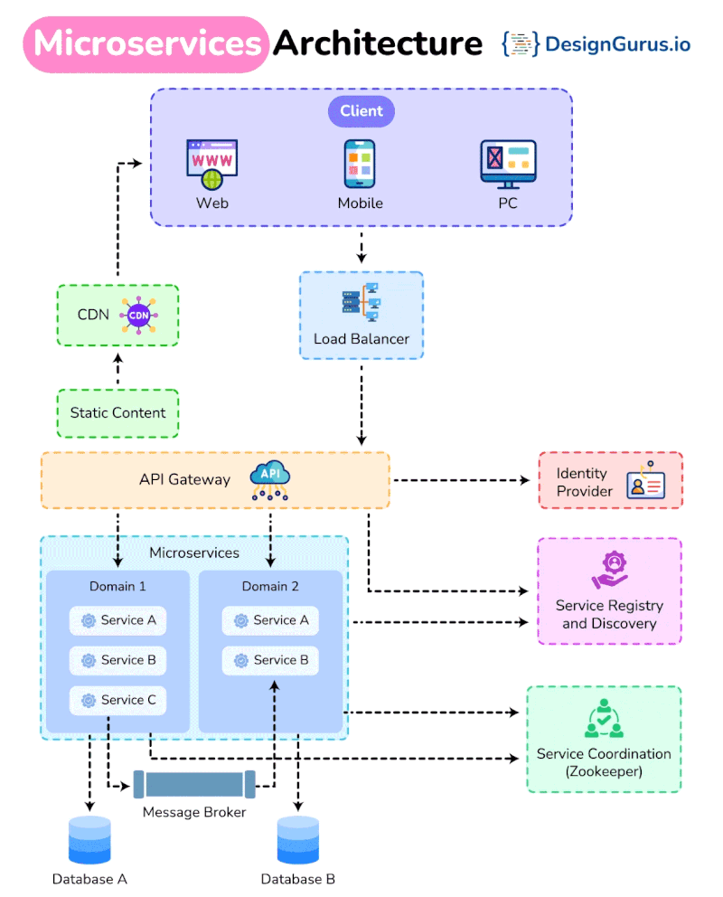

# Entendiendo la Arquitectura de Microservicios

La arquitectura de microservicios divide las aplicaciones en servicios más pequeños e independientes. Aquí tienes un resumen de los 𝟏𝟎 𝐜𝐨𝐦𝐩𝐨𝐧𝐞𝐧𝐭𝐞𝐬 𝐜𝐥𝐚𝐯𝐞 de esta arquitectura:

1. **𝐂𝐥𝐢𝐞𝐧𝐭𝐞**
Estos son los usuarios finales que interactúan con la aplicación a través de diferentes interfaces como web, móvil o PC.

2. **𝐂𝐃𝐍 (Red de Entrega de Contenido)**
Las CDN entregan contenido estático como imágenes, hojas de estilo y archivos JavaScript de manera eficiente al almacenarlos en caché más cerca de la ubicación del usuario, reduciendo los tiempos de carga.

3. **Balanceador de Carga**
Distribuye el tráfico de red entrante entre múltiples servidores, asegurando que ningún servidor se convierta en un cuello de botella y mejorando la disponibilidad y confiabilidad de la aplicación.

4. **Puerta de Enlace API**
Una Puerta de Enlace API actúa como punto de entrada para todos los clientes, manejando tareas como el enrutamiento de solicitudes, composición y traducción de protocolos, lo que ayuda a gestionar múltiples microservicios detrás de escena.

5. **𝐌𝐢𝐜𝐫𝐨𝐬𝐞𝐫𝐯𝐢𝐜𝐢𝐨𝐬**
Cada microservicio es un servicio pequeño e independiente que realiza una función específica de negocio. Se comunican entre sí a través de APIs.

6. **𝐂𝐨𝐫𝐫𝐞𝐝𝐨𝐫 𝐝𝐞 𝐌𝐞𝐧𝐬𝐚𝐣𝐞𝐬**
Un corredor de mensajes facilita la comunicación entre microservicios enviando mensajes entre ellos, asegurando que permanezcan desacoplados y puedan funcionar independientemente.

7. **𝐁𝐚𝐬𝐞𝐬 𝐝𝐞 𝐃𝐚𝐭𝐨𝐬**
Cada microservicio típicamente tiene su propia base de datos para asegurar un acoplamiento débil. Esto puede involucrar diferentes bases de datos para diferentes microservicios

8. **Proveedor de identidad**
Este componente maneja la autenticación y autorización de usuarios, asegurando el acceso seguro a los servicios.

9. **Registro y Descubrimiento de Servicios**
Este sistema lleva un registro de todos los microservicios y sus instancias, permitiendo que los servicios se encuentren y comuniquen entre sí dinámicamente.

10. **𝐂𝐨𝐨𝐫𝐝𝐢𝐧𝐚𝐜𝐢ó𝐧 𝐝𝐞 𝐒𝐞𝐫𝐯𝐢𝐜𝐢𝐨𝐬 (ej., Zookeeper)**
Herramientas como Zookeeper ayudan a gestionar y coordinar servicios distribuidos, asegurando que trabajen juntos de manera fluida.

📌Fundamentos de Diseño de Sistemas - https://lnkd.in/gtcCT-dJ
📌Patrones de Diseño de Microservicios - https://lnkd.in/gDMtPQxi