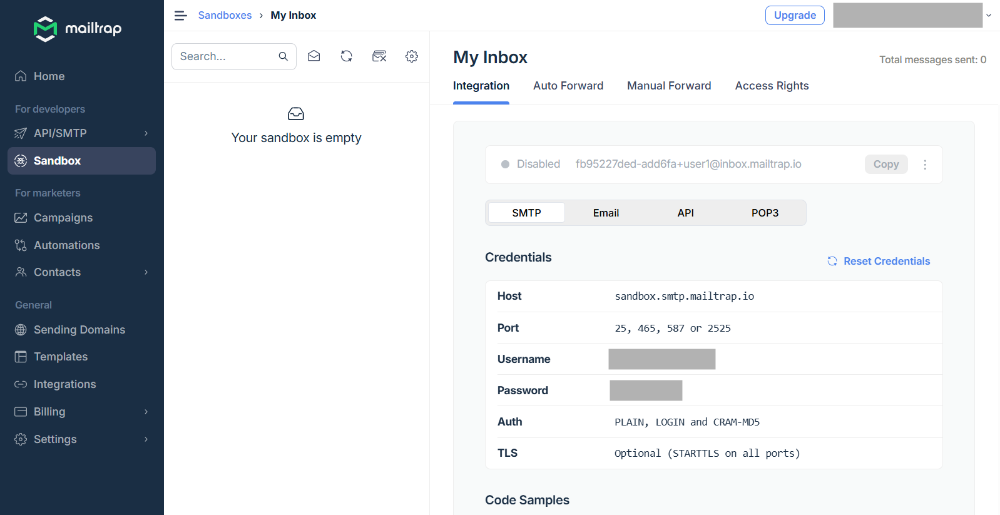
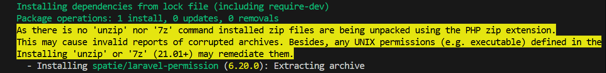
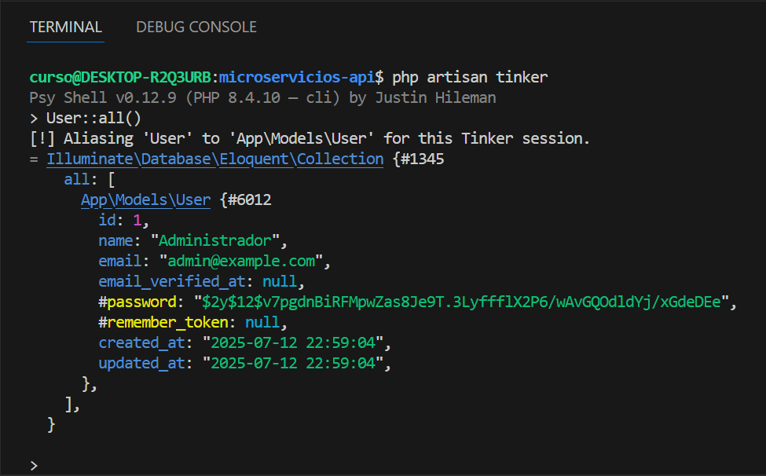
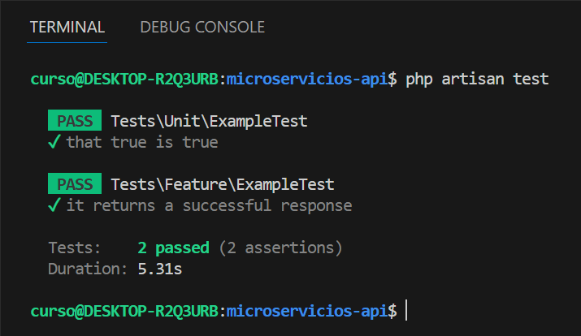

# Tutorial: Proyecto Base para Microservicios con Laravel 12 (sin frontend)

**Docente:** Emilio Gustavo Ormeño  
**Nivel:** Principiante  
**Requisitos previos:** PHP, Composer, terminal  
**Tecnologías:** Laravel 12, Jetstream API, SQLite, Pest, Spatie Permission

## Objetivos de Aprendizaje

- Crear un proyecto Laravel optimizado para microservicios sin frontend  
- Implementar autenticación segura mediante bearer token  
- Configurar autorización basada en roles con Spatie Permission  
- Desarrollar y probar APIs REST con Pest

## 1. Instalación del Proyecto

### 1.1. Requisitos previos

- PHP ≥ 8.2  
- Composer  
- Laravel Installer:  
  ```bash
  composer global require laravel/installer
  ```  
- SQLite (incluido con PHP)  
- Cuenta en [mailtrap.io](https://mailtrap.io)

### 1.2. Crear el proyecto base

```bash
laravel new microservicios-api --api --verification --pest --quiet --database=sqlite
```

**Idem para Windows**

Este comando genera:

- Proyecto **sin vistas**
- Jetstream API para autenticación
- Verificación por email
- Pruebas preconfiguradas con Pest

## 2. Configuración Inicial

### 2.1. Archivo `.env`

```dotenv
APP_NAME="Microservicios API"
DB_CONNECTION=sqlite

MAIL_MAILER=smtp
MAIL_HOST=sandbox.smtp.mailtrap.io
MAIL_PORT=2525
MAIL_USERNAME=tu_usuario
MAIL_PASSWORD=tu_contraseña
MAIL_ENCRYPTION=null
MAIL_FROM_ADDRESS=api@example.com
MAIL_FROM_NAME="${APP_NAME}"

ADMIN_EMAIL=admin@example.com
ADMIN_PASSWORD=secret123
```

> **Nota:** `MAIL_USERNAME` y `MAIL_PASSWORD` se obtienen de Mailtrap.


### 2.2. Migraciones y base SQLite

```bash
php artisan migrate
```

Si el archivo de base no existe, Laravel preguntará si desea crearlo.

## 3. Autenticación con Jetstream API

Laravel 12 incluye Jetstream API, que proporciona una solución completa para autenticación y autorización. Esta implementación utiliza Laravel Sanctum para manejar tokens de acceso y autenticación de usuarios.

Jetstream API:

- Usa Laravel Sanctum
- Agrega verificación de email
- Usa `auth:sanctum` como middleware
- Provee endpoints `/register`, `/login`, `/user`, etc.

### 3.1. Instalar Laravel Sanctum

```bash
composer require laravel/sanctum
```
### 3.2. Publicar la configuración de Sanctum

```bash
php artisan vendor:publish --provider="Laravel\Sanctum\SanctumServiceProvider"
```
### 3.3. Ejecutar las migraciones

```bash
php artisan migrate
```
### 3.4. Crear el controlador de autenticación

```bash
php artisan make:controller Api/AuthController
```

### 3.5. Definir las rutas de autenticación

En routes/api.php, agrega:

```php
<?php
use App\Http\Controllers\Api\AuthController;

Route::post('/register', [AuthController::class, 'register']);
Route::post('/login', [AuthController::class, 'login']);
Route::middleware('auth:sanctum')->group(function () {
    Route::post('/logout', [AuthController::class, 'logout']);
    Route::get('/user', [AuthController::class, 'user']);
});
```
### 3.6. Implementar el AuthController

```php
<?php

namespace App\Http\Controllers\Api;

use App\Models\User;
use Illuminate\Http\Request;
use Illuminate\Support\Facades\Hash;
use App\Http\Controllers\Controller;
use Illuminate\Validation\ValidationException;

class AuthController extends Controller {
    public function register(Request $request) {
        $request->validate([
            'name' => 'required|string|max:255',
            'email' => 'required|string|email|max:255|unique:users',
            'password' => 'required|string|min:8|confirmed',
        ]);

        $user = User::create([
            'name' => $request->name,
            'email' => $request->email,
            'password' => Hash::make($request->password),
        ]);

        $token = $user->createToken('auth_token')->plainTextToken;

        return response()->json([
            'user' => $user,
            'token' => $token,
            'token_type' => 'Bearer',
        ], 201);
    }

    public function login(Request $request) {
        $request->validate([
            'email' => 'required|email',
            'password' => 'required',
        ]);

        $user = User::where('email', $request->email)->first();

        if (!$user || !Hash::check($request->password, $user->password)) {
            throw ValidationException::withMessages([
                'email' => ['The provided credentials are incorrect.'],
            ]);
        }

        $token = $user->createToken('auth_token')->plainTextToken;

        return response()->json([
            'user' => $user,
            'token' => $token,
            'token_type' => 'Bearer',
        ]);
    }

    public function logout(Request $request) {
        $request->user()->currentAccessToken()->delete();

        return response()->json(['message' => 'Successfully logged out']);
    }

    public function user(Request $request) {
        return response()->json($request->user());
    }
}
```

## 4. Autorización con Spatie Permission

### 4.1. Instalar la librería

```bash
composer require spatie/laravel-permission
```

> **Nota:** Si el comando muestra el siguiente warning, puedes instalar 7zip para evitarlo:
 
`sudo apt update`
`sudo apt install p7zip-full`

### 4.2. Publicar y migrar

```bash
php artisan vendor:publish --provider="Spatie\\Permission\\PermissionServiceProvider"
php artisan migrate
```

### 4.3. Configurar el modelo `User`
Edita el modelo `User.php` para incluir los traits necesarios, los cuales permiten manejar roles y permisos, éstos son:

- `HasRoles`: para manejar roles y permisos
- `MustVerifyEmail`: para que el usuario deba verificar su email antes de poder iniciar sesión. Esto es útil para asegurar que los usuarios son quienes dicen ser.
- `Notifiable`: para notificaciones
- `HasFactory`: para usar fábricas de modelos

```php
<?php
namespace App\Models;

use Illuminate\Auth\MustVerifyEmail;
use Spatie\Permission\Traits\HasRoles;
use Illuminate\Notifications\Notifiable;
use Illuminate\Database\Eloquent\Factories\HasFactory;
use Illuminate\Foundation\Auth\User as Authenticatable;

class User extends Authenticatable
{
    use HasFactory, Notifiable, HasRoles, MustVerifyEmail;

    protected $fillable = ['name','email','password'];

    protected $hidden = ['password','remember_token'];

    protected function casts(): array
    {
        return [
            'email_verified_at' => 'datetime',
            'password' => 'hashed',
        ];
    }
}
```

> **Nota:** En el código anterior, `$fillable` define los campos que se pueden asignar masivamente, mientras que `$hidden` oculta los campos sensibles como la contraseña y el token de recordatorio. El método `casts` convierte automáticamente el `campo email_verified_at` a un objeto `DateTime`, y el campo `password` se almacena de forma segura.

## 5. Seeder de Usuario Administrador

### 5.1. Editar `DatabaseSeeder.php`

```php
<?php
namespace Database\Seeders;

use App\Models\User;
use Illuminate\Database\Seeder;
use Spatie\Permission\Models\Role;

class DatabaseSeeder extends Seeder
{
    public function run(): void
    {
        Role::firstOrCreate(['name' => 'admin']);
        Role::firstOrCreate(['name' => 'user']);

        $admin = User::firstOrCreate(
            ['email' => env('ADMIN_EMAIL')],
            ['name' => 'Administrador', 'password' => bcrypt(env('ADMIN_PASSWORD'))]
        );

        $admin->assignRole('admin');
    }
}
```

### 5.2. Ejecutar

```bash
php artisan db:seed
```

### 5.3. Verificar el usuario
Puedes verificar con la herramienta Tinker que el usuario administrador se creó correctamente ejecutando:

> **Nota:** Tinker es una herramienta de Laravel que permite interactuar con la base de datos y el modelo de forma interactiva.

```bash
php artisan tinker
```



## 6. Pruebas con Pest

Si ejecutaste `laravel new` con la opción `--pest`, ya tienes Pest configurado. Si no, puedes instalarlo con:

```bash
composer require pestphp/pest --dev
php artisan pest:install
```

Ejecuta las pruebas con:

```bash
php artisan test
```

Verás que se ejecutan las pruebas predefinidas de Jetstream y Pest y deberían pasar sin problemas.



### 6.1. Prueba de Registro y Login

Archivo: `tests/Feature/AuthTest.php`

```php
<?php
use Illuminate\Support\Facades\Hash;
use App\Models\User;

it('permite registrar y loguear un usuario', function () {
    $response = $this->postJson('/register', [
        'name' => 'Juan Pérez',
        'email' => 'juan@example.com',
        'password' => 'secret123',
        'password_confirmation' => 'secret123',
    ]);

    $response->assertStatus(201);
    echo "\nRegistro OK";

    $response = $this->postJson('/login', [
        'email' => 'juan@example.com',
        'password' => 'secret123',
    ]);

    $response->assertStatus(200);
    expect($response->json())->toHaveKey('token');
    echo "\nLogin OK con token: " . $response->json('token');
});
```

```bash
php artisan test
```

## 8. Microservicio de Ejemplo: Proyectos

### 8.1. Crear modelo y migración

```bash
php artisan make:model Proyecto -m
```

Migración:

```php
Schema::create('proyectos', function (Blueprint $table) {
    $table->id();
    $table->string('nombre');
    $table->timestamps();
});
```

```bash
php artisan migrate
```

### 8.2. Controlador

```bash
php artisan make:controller ProyectoController
```

`ProyectoController.php`:

```php
use App\Models\Proyecto;
use Illuminate\Http\Request;

class ProyectoController extends Controller
{
    public function index(Request $request)
    {
        $this->authorize('admin-only');
        return Proyecto::all();
    }
}
```

### 8.3. Definir política en `AuthServiceProvider`

```php
use Illuminate\Support\Facades\Gate;

Gate::define('admin-only', fn ($user) => $user->hasRole('admin'));
```

### 8.4. Rutas

`routes/api.php`:

```php
Route::middleware(['auth:sanctum', 'verified'])->group(function () {
    Route::get('/proyectos', [ProyectoController::class, 'index']);
});
```

## 9. Pruebas con Pest: Autorización

Archivo: `tests/Feature/ProyectoTest.php`

```php
use App\Models\User;
use Spatie\Permission\Models\Role;

it('admin puede acceder a /proyectos', function () {
    $admin = User::factory()->create([
        'email_verified_at' => now()
    ]);
    Role::firstOrCreate(['name' => 'admin']);
    $admin->assignRole('admin');

    $token = $admin->createToken('test')->plainTextToken;

    $response = $this->withToken($token)->getJson('/api/proyectos');
    $response->assertStatus(200);

    echo "\nRespuesta proyectos:\n";
    print_r($response->json());
});

it('usuario sin rol no accede a /proyectos', function () {
    $user = User::factory()->create([
        'email_verified_at' => now()
    ]);
    $token = $user->createToken('test')->plainTextToken;

    $response = $this->withToken($token)->getJson('/api/proyectos');
    $response->assertStatus(403);
});
```

## 10. Documentación Manual de la API

```markdown
### GET /api/proyectos

**Autenticación requerida:** Sí (Bearer Token)  
**Roles permitidos:** admin  
**Respuesta esperada:**

[
  {
    "id": 1,
    "nombre": "API de ejemplo",
    "created_at": "...",
    "updated_at": "..."
  }
]
```

## 11. Problemas Comunes

| Problema                                       | Solución                                                                 |
|-----------------------------------------------|--------------------------------------------------------------------------|
| Error `email not verified`                    | Asegurarse de que `email_verified_at` esté seteado en el usuario         |
| Seeder no crea usuario admin                  | Verificar que `ADMIN_EMAIL` y `ADMIN_PASSWORD` estén definidos en `.env` |
| Mail no enviado                               | Confirmar credenciales de Mailtrap                                       |
| Token no válido en pruebas                    | Usar `createToken('nombre')->plainTextToken`                             |

## Conclusión

Este proyecto sirve como base limpia para desarrollar microservicios REST con Laravel 12. Incluye autenticación con tokens, autorización por roles, pruebas automatizadas y documentación mínima. Es ideal para cursos, talleres y proyectos iniciales sin frontend.